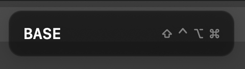
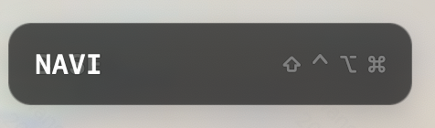
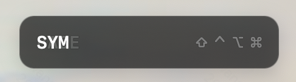
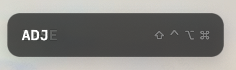

# KeyBeacon

**English** · [中文](#zh)

<a id="en"></a>

**KeyBeacon** shows your keyboard's live internal state — the **active layer** and the **held
modifier keys** — in a small desktop app, over Bluetooth LE. It works with any keyboard that
implements the open **KeyBeacon Protocol (KBP)**, not just one brand or model.

## Screenshots

The floating status panel updates live as you switch layers. Here it is across the Totem's layers:

| Base | Navigation | Symbols | Adjust |
|:---:|:---:|:---:|:---:|
|  |  |  |  |

## Why KeyBeacon

Many ZMK keyboards — the Totem among them — have **no screen**. You press a layer key and have no
on-device way to confirm which layer is actually active. The usual answer is to add hardware: a
small OLED/display, extra wiring, extra firmware, extra cost.

KeyBeacon takes the opposite approach. The host your keyboard is already connected to **has** a
screen, so let the software show the state instead of bolting on hardware. The keyboard simply
reports what it knows over its existing BLE link, and the desktop app displays it. **No extra
hardware, no screen, no soldering** — a displayless keyboard gains a display for free.

**Vision**: start with layer + modifiers, but grow into a **general-purpose window into a keyboard's
internal state**. The protocol is versioned and extensible by design, so future versions can surface
more of what the keyboard knows but can't otherwise show — e.g. battery level, active output/profile,
connection status, caps-word/sticky state — for **any** keyboard that speaks KBP, on any OS.

This repository is the **home of three things**:

| Directory | What |
|-----------|------|
| [`app/macos/`](app/macos/) | The macOS app (menu-bar widget + floating status panel). |
| [`protocol/`](protocol/) | The authoritative, versioned **KeyBeacon Protocol** standard (KBP). |
| [`conformance/`](conformance/) | The **conformance kit** — guide + checklist + self-test tool for keyboard authors. |

> **Platform status**: macOS is available now. **Windows and Linux are planned for the next
> iteration** (they are not yet available). The protocol is OS-neutral by design.

## Roadmap

Where KeyBeacon is headed. Each item is a self-contained **KBP MINOR** addition — a new optional BLE
characteristic — landing across **protocol → firmware → app**, so older apps keep working. The three
most-requested wins for screenless split keyboards lead the list.

### Planned

| Feature | What you'll see | Target |
|---------|-----------------|--------|
| Host link status | connected or not, and which BLE profile (1–5) is active | KBP 1.1 |
| Per-half link | each split half online / offline — spot a dropped half instantly | KBP 1.1 |
| Per-half battery | charge % for every half, so you know which one to charge | KBP 1.1 |
| Active output | whether typing goes to USB or BLE | KBP 1.1 |
| Typing speed | live words-per-minute | KBP 1.2 |

### Exploring

Caps-Word / host lock LEDs (Caps·Num·Scroll) · full active-layer stack (not just the top layer) ·
keystroke & session stats · activity (active / idle / sleep) · RGB & backlight state.

*Candidates, not commitments — each ships when it maps to real keyboard state and earns a place on
the panel. Link-quality (RSSI) and charging state depend on hardware/stack support and come last.*

## Download & run (macOS)

1. Go to the [Releases](https://github.com/ykiewang/keybeacon/releases) page and download the
   latest `BleWidget-<version>.dmg` (or `.zip`).
2. Open the `.dmg` and drag **BleWidget.app** out (or just double-click it from the `.zip`).
3. **First launch (important):** this build is **not yet code-signed/notarized**, so macOS
   Gatekeeper blocks it on first open. **Drag BleWidget.app out of the `.dmg`** (to `/Applications`
   or the Desktop) and **eject the disk image first** — you can't clear the quarantine flag while
   the app sits on the read-only image. Then open it once per the workaround below.
4. When prompted, **grant Bluetooth permission**. The app lives in the **menu bar** (no Dock
   icon). Connect a compatible keyboard and its live layer/modifier status appears.

No terminal, no build tools, no source checkout required.

### First launch: Gatekeeper workaround

Signing + notarization require a paid Apple Developer ID (a pending prerequisite), so releases are
currently **unsigned** and macOS quarantines the download. After dragging the app out of the `.dmg`
and ejecting the image, handle whichever prompt you get:

- **"BleWidget can't be opened because it is from an unidentified developer"**: right-click the app
  → **Open** → confirm once.
- **"BleWidget is damaged and can't be opened. You should eject the disk image."** (common on Apple
  Silicon): the right-click trick does **not** work — clear the quarantine flag once in Terminal
  (adjust the path to where you moved the app):

  ```
  xattr -cr /Applications/BleWidget.app
  ```

You only need this the first time. A future signed release will remove the step entirely.

> **Known limitation this iteration**: because the artifact is unsigned, the "zero-warning,
> double-click, under-5-minutes" goals (spec SC-001/SC-002) and signing (FR-002) are **not met
> yet** — they are deferred to the signed-release follow-up. Everything else (download, run,
> live status) works today.

## Requirements

- macOS 12 (Monterey) or later.
- A keyboard that implements KBP on its host-link (central) BLE role — see
  [`conformance/`](conformance/).

## Build from source (optional)

```bash
cd app/macos
swift build -c release        # or: swift run BleWidget
swift test                    # pure-logic unit tests
```

Package a distributable bundle locally:

```bash
./packaging/make-app.sh 0.0.0-dev   # → dist/BleWidget.app, .dmg, .zip, .sha256
```

## For keyboard authors

**Running ZMK?** You don't need to implement KBP by hand — use the ready-made
[`zmk-keybeacon`](https://github.com/ykiewang/zmk-keybeacon) Zephyr module. Add it to your
`config/west.yml` (pinned to a release tag) and set `CONFIG_ZMK_KEYBEACON=y` on the central
build — no file copying, no `include()`/`rsource`. The two-step setup is documented in the
module's [GETTING-STARTED.md](https://github.com/ykiewang/zmk-keybeacon/blob/main/GETTING-STARTED.md).

**Any other firmware, or implementing from scratch?** Read [`protocol/README.md`](protocol/README.md)
(the standard) and [`conformance/CONFORMANCE.md`](conformance/CONFORMANCE.md) (what to implement),
then run the self-test tool:

```bash
python3 conformance/conformance_tool.py
```

## License

MIT — see [LICENSE](LICENSE). The protocol is intentionally permissively licensed so any keyboard
or app may implement it.

---

<a id="zh"></a>

# KeyBeacon(中文)

[English](#en) · **中文**

**KeyBeacon** 在一个小巧的桌面应用里,通过蓝牙 LE 实时显示键盘的内部状态 —— **当前层**与
**按住的修饰键**。它适用于任何实现了开放的 **KeyBeacon 协议(KBP)** 的键盘,而不限某一品牌或型号。

## 界面预览

悬浮状态面板会随你切换层而实时更新。下面是 Totem 各层下的样子:

| 基础层 | 导航层 | 符号层 | 调节层 |
|:---:|:---:|:---:|:---:|
|  |  |  |  |

## 初衷与愿景

很多 ZMK 键盘 —— 比如 Totem —— **没有屏幕**。你按下层切换键,却无法在键盘本体上确认当前究竟在哪一
层。常见的解法是加硬件:一小块 OLED/显示屏、额外走线、额外固件、额外成本。

KeyBeacon 反其道而行。你的键盘本就连着的那台电脑**有**屏幕,那就用软件来显示状态,而不是再外挂一块
硬件。键盘只需把自己知道的信息通过既有的 BLE 链路上报,桌面应用负责显示。**不需要额外硬件、不需要
屏幕、不需要焊接** —— 一把没有显示屏的键盘,就这样免费获得了"显示屏"。

**愿景**:从"层 + 修饰键"起步,逐步成长为一个**通用的键盘内部状态窗口**。协议在设计上即是带版本、
可扩展的,因此未来版本可以呈现更多键盘已知、却无从展示的信息 —— 例如电量、当前输出/配置、连接状态、
Caps-Word/黏滞键状态 —— 面向**任何**讲 KBP 的键盘、任何操作系统。

本仓库是**三样东西的归属地**:

| 目录 | 内容 |
|------|------|
| [`app/macos/`](app/macos/) | macOS 应用(菜单栏小组件 + 悬浮状态面板)。 |
| [`protocol/`](protocol/) | 权威、带版本的 **KeyBeacon 协议** 标准(KBP)。 |
| [`conformance/`](conformance/) | **一致性套件** —— 面向键盘作者的指南 + 清单 + 自测工具。 |

> **平台状态**:macOS 现已可用。**Windows 与 Linux 顺延至下一期**(暂不可用)。协议在设计上与
> 操作系统无关。

## 路线图

KeyBeacon 的下一步走向。下面每一项都是一个自包含的 **KBP MINOR** 增量——新增一个可选的 BLE 特征——贯穿
**协议 → 固件 → app** 落地,旧版应用会忽略不认识的部分并继续正常工作。面向无屏分体键盘、呼声最高的三项排在最前。

### 计划中

| 功能 | 你会看到 | 目标版本 |
|------|---------|---------|
| 主机连接状态 | 是否真的连上、当前在第几个 BLE profile(1–5) | KBP 1.1 |
| 左右半连接 | 分体每一半在线 / 离线——掉线一眼可见 | KBP 1.1 |
| 每半电量 | 每一半的电量百分比,知道该充哪半 | KBP 1.1 |
| 当前输出 | 键击去向 USB 还是 BLE | KBP 1.1 |
| 打字速度 | 实时每分钟字数(WPM) | KBP 1.2 |

### 探索中

Caps-Word / 主机锁定灯(Caps·Num·Scroll)· 完整激活层栈(不止最高层)·
击键 / 会话统计 · 活动状态(活跃 / 空闲 / 休眠)· RGB 与背光状态。

*这些是候选项而非承诺——每一项只有在能映射到键盘真实状态、且确实值得占面板一席时才会落地。连接质量(RSSI)
与充电状态取决于硬件/协议栈支持,排在最后。*

## 下载即用(macOS)

1. 打开 [Releases](https://github.com/ykiewang/keybeacon/releases) 页面,下载最新的
   `BleWidget-<版本>.dmg`(或 `.zip`)。
2. 打开 `.dmg` 把 **BleWidget.app** 拖出来(或直接从 `.zip` 里双击运行)。
3. **首次启动(重要):** 当前构建**尚未签名/公证**,macOS Gatekeeper 会在首次打开时拦截。请**先把
   BleWidget.app 从 `.dmg` 拖出来**(放到「应用程序」或桌面),并**先推出该磁盘映像**——app 停留在只读
   映像里时无法清除隔离标记。然后按下方的"首次启动:绕过 Gatekeeper"操作打开一次即可。
4. 按提示**授予蓝牙权限**。应用常驻**菜单栏**(无 Dock 图标)。连接一把兼容键盘,其实时的
   层/修饰键状态即会显示。

无需终端、无需构建工具、无需拉取源码。

### 首次启动:绕过 Gatekeeper

签名 + 公证需要付费的 Apple Developer ID(待满足的前置条件),因此当前发布产物均为**未签名**,macOS
会给下载的 app 加上隔离标记。把 app 从 `.dmg` 拖出并推出映像后,按你看到的提示处理:

- 若提示**"无法打开,因为来自身份不明的开发者"**:右键点应用 → **打开** → 确认一次。
- 若提示**"'BleWidget'已损坏,无法打开。你应该推出磁盘映像。"**(Apple Silicon 上常见):右键打开在
  这种情况下**无效**,改在「终端」里执行一次以下命令清除隔离标记(把路径改成你实际放置 app 的位置):

  ```
  xattr -cr /Applications/BleWidget.app
  ```

仅首次需要。将来的签名版本会彻底移除这一步。

> **本期已知限制**:由于产物未签名,"零警告、双击即开、5 分钟内完成"的目标(规范 SC-001/SC-002)
> 与签名(FR-002)**本期尚未达成** —— 它们顺延到签名版本的后续迭代。其余(下载、运行、实时状态)
> 今天即可用。

## 环境要求

- macOS 12(Monterey)或更高版本。
- 一把在其宿主链路(central)BLE 角色上实现了 KBP 的键盘 —— 见
  [`conformance/`](conformance/)。

## 从源码构建(可选)

```bash
cd app/macos
swift build -c release        # 或:swift run BleWidget
swift test                    # 纯逻辑单元测试
```

本地打包可分发的产物:

```bash
./packaging/make-app.sh 0.0.0-dev   # → dist/BleWidget.app、.dmg、.zip、.sha256
```

## 面向键盘作者

**用的是 ZMK?** 无需手写实现 KBP —— 直接用现成的
[`zmk-keybeacon`](https://github.com/ykiewang/zmk-keybeacon) Zephyr 模块:在 `config/west.yml` 中加入
该模块(锁定到发布 tag),并在 central 构建上设置 `CONFIG_ZMK_KEYBEACON=y` 即可 —— 无需复制文件、无需
`include()`/`rsource`。两步接入详见模块的
[GETTING-STARTED.md](https://github.com/ykiewang/zmk-keybeacon/blob/main/GETTING-STARTED.md)。

**其他固件,或从零实现?** 阅读 [`protocol/README.md`](protocol/README.md)(标准)与
[`conformance/CONFORMANCE.md`](conformance/CONFORMANCE.md)(需要实现什么),然后运行自测工具:

```bash
python3 conformance/conformance_tool.py
```

## 许可

MIT —— 见 [LICENSE](LICENSE)。协议特意采用宽松许可,任何键盘或应用都可实现。
